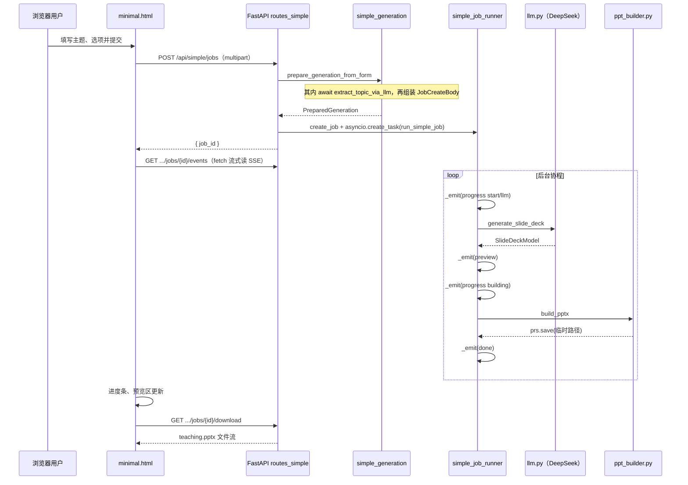

# Teaching PPT — 教学演示文稿自动生成系统

本仓库实现一个**基于大语言模型（LLM）的 Web 应用**：用户输入课程主题、受众与页数等参数；**主题字段**先经 **`extract_topic_via_llm`** 做 JSON 模式下的信息抽取，再与受众、页数一并送入课件生成提示词；后端通过 OpenAI 兼容的聊天补全（默认 **DeepSeek**）得到大纲 JSON，并写入 **PowerPoint（.pptx）** 文件。默认页面 **`/minimal`** 采用 **先创建异步任务 → SSE 推送进度与预览 → 用户确认后下载**；另提供 **`POST /api/simple/generate`** 直接返回文件流，便于脚本调用。项目采用 **Python 异步 Web 框架 FastAPI**，**无独立前端工程与打包构建**，适合作为课程设计或本科毕业论文中「智能教育工具 / AIGC 辅助备课」类课题的实现案例。

---

## 附：从用户一句话到下载 PPT — 全流程逐步实现说明

本节说明**默认页面 `/minimal`** 上，用户用自然语言描述需求后，系统在**代码层面**如何一步步执行，直至可下载的 `teaching.pptx`。可与论文「系统设计 / 实现」章节对照阅读；涉及文件名均为**相对仓库根目录**路径。

### 总览：谁在谁先谁后



---

### 阶段 0：页面加载时前端做的准备

1. 浏览器请求 `GET /minimal`，由 `app/web/routes.py` 返回 **`static/minimal.html`**（单文件内联 CSS/JS，无需构建）。
2. 脚本执行 **`loadPreviewStyles()`**：`fetch('/api/simple/preset-preview-styles')`，把各「幻灯片风格」与「整体配色 / 标题色 / 正文色」等 JSON 缓存在变量 `previewStyles` 中，用于后续「预览区」近似还原成稿配色（与后端 `preset_templates.py`、`slide_style.py` 的色值对齐）。
3. 用户在**课程主题**输入框输入内容；当输入框 **`blur`（失焦）** 时，前端用防抖（约 600ms）请求  
   **`GET /api/simple/normalize-topic?topic=...`**  
   将返回 JSON 中的 `topic` 若与当前输入不一致则**回写输入框**。这样用户在点击生成前，往往已经看到经 **LLM 信息抽取**后的简短主题。  
   **注意**：真正生成时，服务端会**再次**调用同一套 **`extract_topic_via_llm`**，保证「失焦预览」与「提交生成」一致（未配置 Key 时两端均退回首尾空白裁剪，不做规则表剥离）。

---

### 阶段 1：主题里如何得到「关键词 / 核心主题」（信息抽取，非分词）

系统通过**与课件大纲相互独立的一次 Chat Completions 调用**（`topic_extract.py` 专用系统提示 + **`response_format: json_object`**）从口语里抽取**简短、可作标题的主题短语**，写入 `JobCreateBody.topic`，再进入 `generate_slide_deck` 的提示词。失焦请求 `normalize-topic` 与提交表单会**各自**调用同一函数（故完整交互下主题抽取最多两次，另加一次大纲生成）。

- **实现位置**：`app/domain/topic_extract.py` 中的 **`extract_topic_via_llm(...)`**（异步 `httpx` 请求，与 `llm.py` 同一套 OpenAI 兼容 Chat Completions URL 规则）。
- **思路**：
  1. 用户输入截断至 500 字；若为空返回空串。
  2. 若**未配置**服务端 `DEEPSEEK_API_KEY`：不进行模型调用，仅 **`strip`** 并截断至 200 字作为占位（`/minimal` 失焦预览可走此路径；**提交生成**在 `prepare_generation_from_form` 开头仍会因缺 Key 返回 **503**）。
  3. 若有 Key：请求模型只输出 `{"topic":"..."}`；解析 JSON 后取 `topic` 字符串，`strip`，长度上限 200 字。
  4. **HTTP 错误、解析失败或字段异常**：退回与第 2 步相同的裁剪原文，避免整条链路因抽取失败而中断。
- **示例**：`"请帮我生成什么是线性代数"` → 模型可能抽成 **`线性代数入门`** 或 **`什么是线性代数`**（由模型在提示约束下决定），再交给 `generate_slide_deck`。

**提交表单时**：在 `prepare_generation_from_form` 里对 `topic` **再次** `await extract_topic_via_llm`；若结果为空则 **400**。

---

### 阶段 2：用户点击「开始生成」— 创建任务与一次性校验

1. 前端 **`preventDefault`** 阻止表单的默认提交；用 **`FormData(form)`** 打包所有字段（主题、受众、页数、`template_preset`、`style_palette`、字号/颜色选项、可选图片等）。
2. **`POST /api/simple/jobs`**（`app/api/routes_simple.py`）：
   - 进入 **`prepare_generation_from_form`**：
     - 读取服务端 **`DEEPSEEK_API_KEY`**；若缺失则 **503**，不在页面填 Key。
     - 校验 **`template_preset`**、`style_palette` 及字号/颜色枚举是否合法；校验图片类型与大小。
     - 为输出 **`.pptx`** 与可选配图在系统临时目录创建路径，记入 **`PreparedGeneration.tmp_paths`**（便于失败或下载后统一删除）。
     - 组装 **`JobCreateBody`**：其中 **`api_key`** 为服务端密钥；**`topic`** 已经过信息抽取；**`style`** 为 `SlideStyleOptions`（palette、title/body size/color 等）。
   - **`create_job()`**：生成 **UUID** 作为 **`job_id`**，在内存字典 **`JOBS`** 中放入 **`SimpleGenerationJob`**（含空列表 **`events`**）。
   - **`asyncio.create_task(run_simple_job(job, prepared))`**：在事件循环里**后台启动**协程，**不阻塞** HTTP 响应。
3. 接口立即返回 **`{"job_id": "<uuid>"}`**，前端进入「监听进度」阶段。

同一套准备逻辑若走 **`POST /api/simple/generate`**，则不会建 job，而是在当前请求内直接调 LLM + `build_pptx` 并以 **FileResponse** 返回文件（适合无 UI 的脚本）。

---

### 阶段 3：后台协程里「进度事件」如何产生

**实现位置**：`app/services/simple_job_runner.py` 中的 **`run_simple_job`**。

1. 记录 **`job.out_path`**、**`job.paths_after_download = list(prepared.tmp_paths)`**，供下载后按列表删文件。
2. **`_emit(job, payload)`**：把字典 **`append`** 到 **`job.events`**。这是**追加式日志**；后续 SSE 端点按顺序把这些字典写给客户端。
3. **事件顺序（成功路径）**大致为：
   - **`{ "type": "progress", "stage": "start", "percent": 8, "message": "..." }`**
   - **`{ "type": "progress", "stage": "llm", "percent": 28, "message": "..." }`**
   - 调用 **`generate_slide_deck`**（见下一阶段）→ 得到 **`SlideDeckModel`**
   - **`{ "type": "preview", "deck": {...}, "topic", "audience", "template_preset", "style": {...}, "has_cover_image", "has_logo" }`**  
     其中 **`deck`** 与即将写入 PPT 的幻灯片列表一致，供浏览器**不打开 Office 也能核对文字结构**。
   - **`{ "type": "progress", "stage": "building", "percent": 72, "message": "..." }`**
   - **`build_pptx`**（见阶段 6）写完磁盘上的临时 `.pptx`
   - **`{ "type": "done", "percent": 100, "message": "..." }`**
4. 任一环节抛错：对已创建的临时文件 **`cleanup_temp_paths`**，**`_emit({ "type": "error", "detail": "..." })`**，并将 **`job.finished = True`**。

---

### 阶段 4：如何接入大模型并得到「可写盘」的结构

**实现位置**：`app/domain/llm.py` 中的 **`generate_slide_deck(body: JobCreateBody, timeout_s)`**。

1. **构造用户侧自然语言**：把经主题抽取后的 **`body.topic`**、**`body.audience`**、**`body.slide_count`** 拼成一段 **`user_content`**（例如「主题：… 受众：… 需要约 N 页幻灯片内容。」）。
2. **系统提示词 `SYSTEM_PROMPT`**：强制模型输出**纯 JSON**，结构为 **`slides`** 数组，每项含 **`title`、`bullets` 数组、`notes`**；并要求页数与要点条数范围；教学语气简洁。
3. **HTTP 请求**：使用 **`httpx.AsyncClient`** **`POST`** 到 **`{api_base}/v1/chat/completions`**（与 OpenAI 兼容的 Chat Completions）；请求体包含 **`model`**、**`messages`**（system + user）、**`temperature`**、**`response_format": {"type": "json_object"}`**。
4. **鉴权**：**`Authorization: Bearer <服务端 api_key>`**。
5. **解析响应**：
   - 从 **`choices[0].message.content`** 取字符串；
   - 先 **`json.loads`**；失败则用正则 **`re.search(r'\{[\s\S]*\}', text)`** 截取第一段 JSON 再解析（缓解模型偶发夹杂说明文字的情况）。
6. **强校验**：**`SlideDeckModel.model_validate(obj)`**（Pydantic）；若 **`slides`** 为空则报错。  
   得到内存中的 **`SlideDeckModel`**，即可被 **`ppt_builder`** 消费。

---

### 阶段 5：浏览器侧「进度可视化」与「预览」如何实现

**进度条与阶段标签**

- **`GET /api/simple/jobs/{job_id}/events`** 返回 **`StreamingResponse`**，`media_type` 为 **`text/event-stream`**。
- 生成器（`event_gen`）在循环中读取 **`job.events`** 中**尚未发送**的项，按 SSE 惯例写出多行：
  - `data: {JSON}\n\n`
- 前端**不用**浏览器原生 **`EventSource`**（避免断线自动重连导致重复处理），而是用 **`fetch`** 拿到 **`ReadableStream`**，按 **`\n\n`** 分块，解析以 **`data:`** 开头的行并 **`JSON.parse`**。
- 收到 **`type === "progress"`**：根据 **`percent`** 更新进度条宽度，根据 **`stage`** 更新 「连接 / AI 大纲 / 合成 PPT / 完成」等步骤高亮（见 **`minimal.html`** 中 **`setProgress`**）。
- 收到 **`type === "preview"`**：调用 **`applyPreviewVarsMerged`**（依据 `template_preset`、`style.palette`、标题/正文颜色 ID 与字号档位）设置 CSS 变量，再 **`renderPreview`** 把 **`deck.slides`** 渲染成横向滚动的「小幻灯片」卡片（封面 + 各页标题与要点，可展开讲稿备注）。
- 收到 **`type === "done"`**：启用 **「下载 teaching.pptx」** 按钮。
- 收到 **`type === "error"`**：在页面展示错误信息，并隐藏工作台或保留已出现的进度视业务需求（当前实现会 **`showErr`** 并视情况收起工作台）。

---

### 阶段 6：从结构化大纲到真实 `.pptx` 文件

**实现位置**：`app/domain/ppt_builder.py` 中的 **`build_pptx`**；视觉合并规则在 **`slide_style.py`** 的 **`merge_preset_with_style`** 及 **`preset_templates.py`**。

1. 根据 **`template_preset`** 取 **`PresetVisual`**（基准色与基准字号）。
2. 用 **`merge_preset_with_style`** 叠加上用户在表单中选择的 **整体配色 palette**、**标题/正文字号档**、**标题/正文颜色**等，得到最终 **`PresetVisual` 等价数据**。
3. **`Presentation()`** 新建空白演示文稿，使用默认 **标题页 + 标题与内容** 版式：
   - 第一页写入课程主题与受众，应用封面样式；若有 **封面配图** 则在封面右侧按固定比例插入图片。
   - 对 **`deck.slides`** 中每一页：填充标题与要点列表、备注；应用内容页样式；若配置了 **角标图**，在内容页右下角插入。
4. **`prs.save(prepared.out_path)`** 写入此前在临时目录创建的 **`.pptx` 路径**（该路径同时记在 **`job.paths_after_download`** 与 **`PreparedGeneration.tmp_paths`** 中）。

---

### 阶段 7：用户下载与服务器清理

1. 用户点击 **「下载」**：前端 **`fetch('/api/simple/jobs/{id}/download')`**。
2. **`download_job_result`** 检查任务已 **`finished`** 且 **`out_path`** 文件仍存在，则以 **`FileResponse`** 返回，并挂 **`BackgroundTask(cleanup_after_download, job_id)`**。
3. **`cleanup_after_download`**：从 **`JOBS`** **弹出**该任务对象，遍历 **`paths_after_download`** 中所有路径尝试 **`unlink`**——包括 **输出 `.pptx`、临时配图、以及生成过程中产生的其他临时文件**，避免磁盘堆积与重复下载。

---

### 小结（论文可摘的三句话）

1. **主题信息抽取**：通过 **`extract_topic_via_llm`**（JSON 模式 + 专用提示）从口语中抽出稳定 **`topic`**，再与课件生成大模型提示词拼接。  
2. **模型输出结构化**：**JSON 模式 + Pydantic 校验**，将自然语言生成落在 **`SlideDeckModel`** 上，再经 **python-pptx** 写入 OOXML。  
3. **体验层**：**异步任务 + 内存事件队列 + SSE** 实现进度与大纲预览；**独立下载接口 + 后台任务删除临时文件** 完成闭环。

---

## 一、项目定位与论文可用切入点

| 角度 | 说明 |
|------|------|
| **问题背景** | 教师备课中 PPT 制作耗时；自然语言描述主题即可生成初稿，可减轻重复性劳动。 |
| **技术路线** | 「**提示工程 + 约束输出 JSON** → **服务端校验与落盘 PPTX**」的管道式架构，易于在论文中画数据流图。 |
| **创新/工作量的体现** | 主题 LLM 信息抽取、多风格内置版式、**固定配色方案**与可选配图、**异步任务 + SSE 进度与预览**、临时文件与任务清理等工程细节。 |
| **对比维度** | 与纯聊天机器人对比：本系统将 LLM 输出**结构化**并**对接办公文档格式**；与离线模板填充对比：内容由模型**动态生成**。 |

---

## 二、技术栈总览

| 层次 | 技术 | 版本要求（见 `requirements.txt`） | 作用 |
|------|------|-------------------------------------|------|
| 语言运行时 | Python 3 | 建议 3.11+（`start-minimal.cmd` 提示） | 后端与脚本 |
| Web 框架 | **FastAPI** | ≥0.109 | 异步 ASGI 应用、路由、表单上传、OpenAPI 能力 |
| ASGI 服务器 | **Uvicorn**（`standard` 额外依赖） | ≥0.27 | 生产/开发环境启动 HTTP 服务 |
| HTTP 客户端 | **HTTPX** | ≥0.26 | 异步请求 DeepSeek（OpenAI 兼容）API |
| 数据校验 / 配置 | **Pydantic v2**、**pydantic-settings** | ≥2.5 / ≥2.1 | 请求体模型、环境变量与 `.env` 配置 |
| 多部分表单 | **python-multipart** | ≥0.0.9 | `UploadFile` / `Form` 混合提交 |
| 文档生成 | **python-pptx** | ≥0.6.23 | 创建与修改 `.pptx`（OOXML） |
| 前端 | 原生 **HTML5 / CSS / JavaScript** | — | 单页表单，无 React/Vue/Webpack |

**外部依赖服务**：DeepSeek（或任意兼容 `POST .../v1/chat/completions` 的网关）。**API Key 仅通过服务端配置**（环境变量 `DEEPSEEK_API_KEY` 或 `.env`），**不在网页表单中收集**。

---

## 三、系统架构：前后端如何组织

### 3.1 总体形态（B/S，前后端逻辑划分）

- **浏览器**访问 `GET /minimal`，得到单页 **`static/minimal.html`**（内联 CSS/JS，亮色主题）。
- 前端通过 **`fetch`** 调用同源 API，典型流程为：
  1. `GET /api/simple/normalize-topic?topic=...`：主题输入框失焦时调用与服务端相同的 `extract_topic_via_llm`（未配 Key 时仅裁剪空白与长度）；
  2. `GET /api/simple/preset-preview-styles`：拉取内置「幻灯片风格」与「整体配色」预览用色值（供预览区 CSS）；
  3. `POST /api/simple/jobs`：`multipart/form-data` 提交表单，立即返回 `{ "job_id": "..." }`；
  4. `GET /api/simple/jobs/{job_id}/events`：`text/event-stream`（SSE），推送 `progress` / `preview` / `done` / `error`；
  5. `GET /api/simple/jobs/{job_id}/download`：任务成功后下载 **`teaching.pptx`**（下载完成后服务端清理该任务临时文件）。
- **直连下载**（无进度与预览 UI）：`POST /api/simple/generate`，请求体与 `/jobs` 同类表单字段，响应为 **PPTX 二进制流**（`FileResponse`）。
- **根路径** `GET /` **307 重定向**到 `/minimal`。

这是一种典型的 **「静态页面 + REST/SSE 混合调用」**：论文中可表述为轻量级前后端分离（接口契约清晰，表现层为静态资源）。

### 3.2 后端目录与分层（便于论文画「模块图」）

```
app/
  main.py              # FastAPI 应用入口：挂载静态目录、注册路由、健康检查
  settings.py          # pydantic-settings：应用名、超时、DeepSeek base/model/key（仅服务端）
  api/
    routes_simple.py   # /api/simple/*：normalize-topic、预览样式、generate、jobs、events、download
  web/
    routes.py          # / 重定向、/minimal 返回 HTML
  domain/
    models.py          # SlideModel / SlideDeckModel / JobCreateBody（含 style.palette）
    llm.py             # 调用聊天 API、解析 JSON、校验为 SlideDeckModel
    ppt_builder.py     # 空白演示文稿 + 内置版式写入内容并 save
    topic_extract.py   # extract_topic_via_llm：对主题字段做 LLM 信息抽取
    preset_templates.py# 多种幻灯片风格：背景色与标题/正文样式（与 slide_style 预设配色可叠加）
    slide_style.py     # 固定配色方案（palette）与 merge_preset_with_style
  services/
    simple_generation.py  # 表单校验、临时文件、组装 JobCreateBody
    simple_job_runner.py    # 内存任务、SSE 事件、build_pptx 编排
static/
  minimal.html         # 主界面：表单、进度、预览、下载
```

**设计含义**：`api` / `web` 负责 **HTTP 与 IO**，`domain` 负责 **业务规则与领域模型**，`services` 负责 **跨领域编排**（异步任务、临时路径生命周期）。

### 3.3 前端表单字段（`/minimal`）

| 区块 | 字段名（`multipart`） | 说明 |
|------|----------------------|------|
| 内容与受众 | `topic`（必填）、`audience`、`slide_count`（3–30） | 主题经 `extract_topic_via_llm` 信息抽取 |
| 外观 | `template_preset` | 内置 9 种风格 ID：`simple`、`cartoon`、`academic`、`forest`、`ocean`、`sunset`、`tech`、`elegant`、`chalk_dark`（见 `preset_templates.PRESET_LABELS`） |
| 个性化（可选） | `style_palette` | 整体背景配色：`theme` 或 `crisp`、`business_blue` 等（见 `slide_style.PALETTE_LABELS`） |
| 个性化（可选） | `style_title_size`、`style_body_size` | 标题 / 正文（含要点与封面副标题）字号档：`theme`、`compact`、`enlarged`、`prominent`（见 `TITLE_SIZE_LABELS` / `BODY_SIZE_LABELS`） |
| 个性化（可选） | `style_title_color`、`style_body_color` | 标题色 / 正文与副标题色：均为**固定色名**（见 `TITLE_COLOR_CHOICES` / `BODY_COLOR_CHOICES`）；`theme` 表示不单独覆盖 |
| 配图（可选） | `cover_image`、`logo_image` | 封面右侧配图、内容页右下角角标；JPG/PNG/GIF/WebP，单张 ≤8MB |
| （无） | — | **不提供** DeepSeek API Key、**不提供** 上传 `.pptx` 模板、**不提供** 自由填写 RGB |

**交互要点**：提交后消费 SSE；收到 `preview` 后按「风格 + 个性化选项」渲染横向滚动预览；`done` 后启用下载按钮；下载走 `GET .../download`。

---

## 四、核心业务流程

### 4.1 异步路径（页面默认，`POST /jobs` + SSE + `download`）

1. **服务端密钥**：仅使用 `Settings.deepseek_api_key`；未配置则 **503**，提示配置 `DEEPSEEK_API_KEY`。
2. **参数校验**：`template_preset`、`style_palette`、字号与颜色选项均在允许集合内；原始 `topic` 经 **`extract_topic_via_llm`** 后非空；可选图片写入临时路径。
3. **拼装 `JobCreateBody`**：含 `style`（`SlideStyleOptions`：`palette`、`title_size`、`body_size`、`title_color`、`body_color`）、`api_key`（服务端值，不来自表单）。
4. **后台任务**：`generate_slide_deck` → 推送 `preview`（含 `deck` JSON 与 `style`）→ `build_pptx`（空白 `Presentation` + 合并后的视觉参数 + 可选配图）。
5. **下载与清理**：`FileResponse` + `BackgroundTask` 删除该 `job_id` 关联的**全部**临时文件（含配图与输出 `.pptx`）。

### 4.2 同步路径（`POST /generate`）

与上类似，但在同一请求内完成生成并直接返回 PPTX；失败 **502** 并清理临时文件。

**错误处理**：参数与校验问题多为 **400**；LLM/写盘失败 **502**；未配置 Key **503**。

---

## 五、LLM 集成（DeepSeek / OpenAI 兼容）

全链路中与模型相关的调用有两类（均为同一兼容协议，密钥均来自服务端 Settings，不经过浏览器）：

| 用途 | 模块 | 输出形态 | 超时（当前实现） |
|------|------|-----------|------------------|
| 主题信息抽取 | `app/domain/topic_extract.py` → **`extract_topic_via_llm`** | `{"topic":"..."}`，解析后写入 `JobCreateBody.topic` | **`min(30, httpx_timeout_s)`** 秒 |
| 幻灯片大纲生成 | `app/domain/llm.py` → **`generate_slide_deck`** | `SlideDeckModel`（Pydantic 校验） | **`httpx_timeout_s`**（如 120 秒） |

共性：

- **协议**：`POST` 到经规范化后的 **`.../v1/chat/completions`**（若配置的 `api_base` 已含 `/v1` 则不再重复拼接）；**`Authorization: Bearer <密钥>`**。
- **JSON 模式**：两段调用均使用 **`response_format: {"type": "json_object"}`**（网关不支持时仍尝试解析 `content` 内 JSON）。

---

## 六、PPTX 生成与版式策略

**模块**：`app/domain/ppt_builder.py`、`app/domain/preset_templates.py`、`app/domain/slide_style.py`

- 使用 **`Presentation()`** 默认版式：**封面** + 多页「标题与内容」。
- **`template_preset`**：从 `get_preset_visual` 取基准色与字号。
- **`merge_preset_with_style`**（`slide_style.py`）顺序大致为：若 `style.palette` ≠ `theme`，用 `STYLE_PALETTES` **整体替换**背景与文字色（仍带基准字号）；若 `style.title_color` / `style.body_color` ≠ `theme`，用预设色块**再覆盖**封面/内容标题色或正文与封面副标题色；若 `style.title_size` / `style.body_size` ≠ `theme`，在基准上对标题或正文磅值做**有限档位增量**（并限制在合理区间）。
- **配图**：`cover_image_path`、`logo_image_path` 非空时，分别以固定几何位置插入封面右侧与内容页右下。
- **内容填充**：要点为空时有占位句；支持演讲者备注写入 `notes_slide`。

> **说明**：当前版本**不支持**用户上传 `.pptx` 作为母版；若论文需写「可扩展为上传模板」，可作为展望。

---

## 七、主题信息抽取（自然语言预处理）

**模块**：`app/domain/topic_extract.py`

- `GET /api/simple/normalize-topic` 与生成链路共用 **`extract_topic_via_llm`**，保证失焦预览与提交一致；抽取超时单独限制为 `min(30s, httpx_timeout_s)`。

---

## 八、配置与安全说明

| 配置项 | 来源 | 含义 |
|--------|------|------|
| `DEEPSEEK_API_KEY` / `.env` | pydantic-settings | **唯一**推荐 Key 来源；**不由浏览器提交** |
| `deepseek_api_base`、`deepseek_model` | Settings | 默认 `https://api.deepseek.com/v1`、`deepseek-chat` |
| `httpx_timeout_s` | Settings | **大纲生成**等主链路 LLM 超时；**主题抽取**单独使用 `min(30, httpx_timeout_s)` |
| `output_dir` | Settings | 预留；主流程以系统临时文件为主 |

**安全提示**（论文「风险与改进」可用）：

- Key 不经过前端，降低泄露面；部署时仍需保护服务器环境与密钥文件权限。
- 上传配图限制类型与大小；未做恶意文件深度检测。
- LLM 输出需**人工审核**后再用于正式教学。

---

## 九、运行与验证

### 9.1 Windows 推荐（本仓库）

双击 **`start-minimal.cmd`**：创建/使用根目录 **`.venv`**，在新窗口启动 Uvicorn，轮询 **`GET http://127.0.0.1:8000/health`** 后打开 **`http://127.0.0.1:8000/minimal`**。

依赖列表见 **`requirements.txt`**；手动启动示例：

```bash
.venv\Scripts\pip install -r requirements.txt
.venv\Scripts\uvicorn app.main:app --host 127.0.0.1 --port 8000
```

**运行前**：在环境变量或项目根目录 `.env` 中配置 **`DEEPSEEK_API_KEY`**。

### 9.2 最小功能路径

1. 配置服务端 `DEEPSEEK_API_KEY`；
2. 浏览器打开 `/minimal`；
3. 填写主题等字段，提交 → 查看进度与预览 → 点击下载 **`teaching.pptx`**。

---

## 十、与本科论文章节的对应建议

| 论文章节 | 本项目对应内容 |
|----------|----------------|
| 绪论 / 意义 | 备课效率、AIGC 在教育中的形态 |
| 相关技术 | FastAPI、REST/SSE、HTTPX、Pydantic、python-pptx、LLM API |
| 需求分析 | 主题/受众/页数/风格/配色/配图、预览与下载、错误提示 |
| 总体设计 | B/S、静态前端 + API、domain + services 分层 |
| 详细设计 | `extract_topic_via_llm`、`generate_slide_deck`、`merge_preset_with_style`、`build_pptx`、任务与 SSE |
| 实现与测试 | 联调 DeepSeek、未配置 Key、非法 palette、SSE 断连与下载清理 |
| 总结展望 | 持久化任务队列、用户体系、**可选**上传学校模板、RAG 等 |

---

## 十一、附录：主要 HTTP 接口与表单字段

### 11.1 接口一览

| 方法 | 路径 | 说明 |
|------|------|------|
| GET | `/health` | 健康检查 `{"status":"ok"}` |
| GET | `/` | 307 → `/minimal` |
| GET | `/minimal` | 教学生成单页 HTML |
| GET | `/api/simple/normalize-topic` | 查询参数 `topic`，返回 `{"topic":"..."}`（LLM 抽取，未配 Key 时近似为裁剪） |
| GET | `/api/simple/preset-preview-styles` | 返回 `presets`、`labels`、`palettes`、`palette_labels`，以及 `title_colors`、`body_colors` 与各选项中文 `*_labels`（供前端预览） |
| POST | `/api/simple/generate` | 见下表「生成表单字段」，响应 PPTX 文件流 |
| POST | `/api/simple/jobs` | 同上表单字段，响应 `{"job_id":"uuid"}` |
| GET | `/api/simple/jobs/{job_id}/events` | SSE：`progress` / `preview` / `done` / `error` |
| GET | `/api/simple/jobs/{job_id}/download` | 任务成功后下载 `teaching.pptx`，随后清理临时文件 |

静态资源：`/static` → 仓库 `static/`（`app/main.py` 中 `StaticFiles`）。

### 11.2 `POST /api/simple/generate` 与 `POST /api/simple/jobs` 共用表单字段

均为 **`multipart/form-data`**：

| 字段 | 类型 | 必填 | 说明 |
|------|------|------|------|
| `topic` | string | 是 | 课程主题（≤500 字），服务端 `extract_topic_via_llm` |
| `audience` | string | 否 | 默认 `大学生` |
| `slide_count` | int | 否 | 默认 8，范围 3–30 |
| `template_preset` | string | 否 | 默认 `simple`，须为 `VALID_PRESET_IDS` 之一 |
| `style_palette` | string | 否 | 默认 `theme`；非 `theme` 时须为 `STYLE_PALETTES` 的键 |
| `style_title_size` | string | 否 | 默认 `theme`；`compact` / `enlarged` / `prominent` |
| `style_body_size` | string | 否 | 默认 `theme`；同上 |
| `style_title_color` | string | 否 | 默认 `theme`；非 `theme` 时须为 `TITLE_COLOR_CHOICES` 的键 |
| `style_body_color` | string | 否 | 默认 `theme`；非 `theme` 时须为 `BODY_COLOR_CHOICES` 的键 |
| `cover_image` | file | 否 | 封面配图 |
| `logo_image` | file | 否 | 内容页角标 |

**不包含**：`api_key`、`use_template`、`template`、用户自定义 RGB/十六进制颜色字符串。

---

以上为与**当前代码库一致**的技术说明与论文素材；实现细节以 `app/` 下源文件为准。
